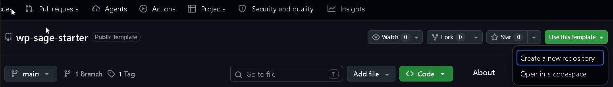

# WordPress Sage Starter

Reusable WordPress starter for marketing websites, built with Bedrock, Sage, Tailwind CSS, Gutenberg, and ACF Free.

This starter is a template of origin. Generated projects evolve independently.

## Requirements

- PHP >= 8.3
- Composer >= 2.x
- Node.js
- WP-CLI available on PATH
- Git

The scripts resolve these from PATH. If one isn't on PATH, or you need to pin a specific installation, set the matching environment variable to its executable path instead of editing any script: `STARTER_PHP`, `STARTER_COMPOSER`, `STARTER_WP_CLI`, `STARTER_GIT`, `STARTER_NODE`, `STARTER_NPM`.

## Setup

1. Create your own copy of this repo under your account, then `cd` into it:

   - **Web**: on [this repo's GitHub page](https://github.com/Carlos-CMP/wp-sage-starter), click **Use this template**, then clone *your new repo* (not this one):

     

     ```powershell
     git clone https://github.com/<your-account>/<your-new-repo>.git
     cd <your-new-repo>
     ```
   - **GitHub CLI** (requires [`gh`](https://cli.github.com/), separate from Git): does both steps at once —

     ```powershell
     gh repo create <your-account>/<your-new-repo> --template Carlos-CMP/wp-sage-starter --clone
     cd <your-new-repo>
     ```
2. Check requirements:

   ```powershell
   .\scripts\doctor.ps1
   ```
3. Point LocalWP at this repo (requires a LocalWP site already created with WordPress installed):

   ```powershell
   .\scripts\link-localwp.ps1 -LocalSitePath "$env:USERPROFILE\Local Sites\starter-sage-wp"
   ```
4. Install and configure the project:

   ```powershell
   .\scripts\new-project.ps1 -ProjectName "My Project" -Domain "my-project.local" -DbHost "127.0.0.1:10023"
   ```
   Use `-Domain "localhost:<port>"` in LocalWP's localhost Routing Mode. `.env` keys: see `.env.example`.
5. Final check:

   ```powershell
   .\scripts\validate.ps1
   ```

Other commands: `.\scripts\wp.ps1 --info` (WP-CLI), `.\scripts\seed-demo-content.ps1` (re-seed demo homepage).

## Architecture

https://carlos-cmp.github.io/wp-sage-starter/runtime-architecture/runtime-architecture.html
