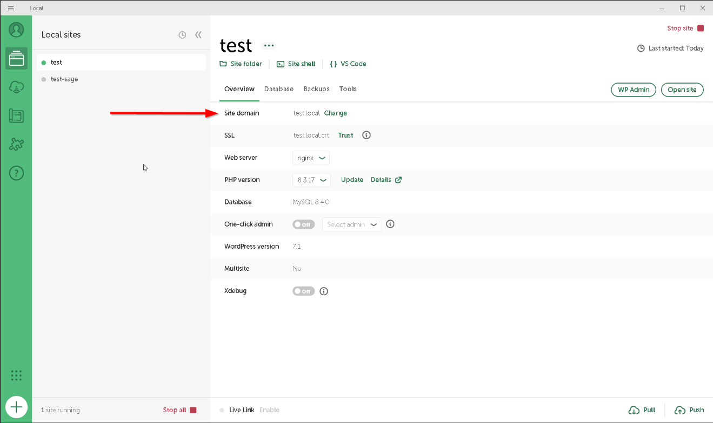
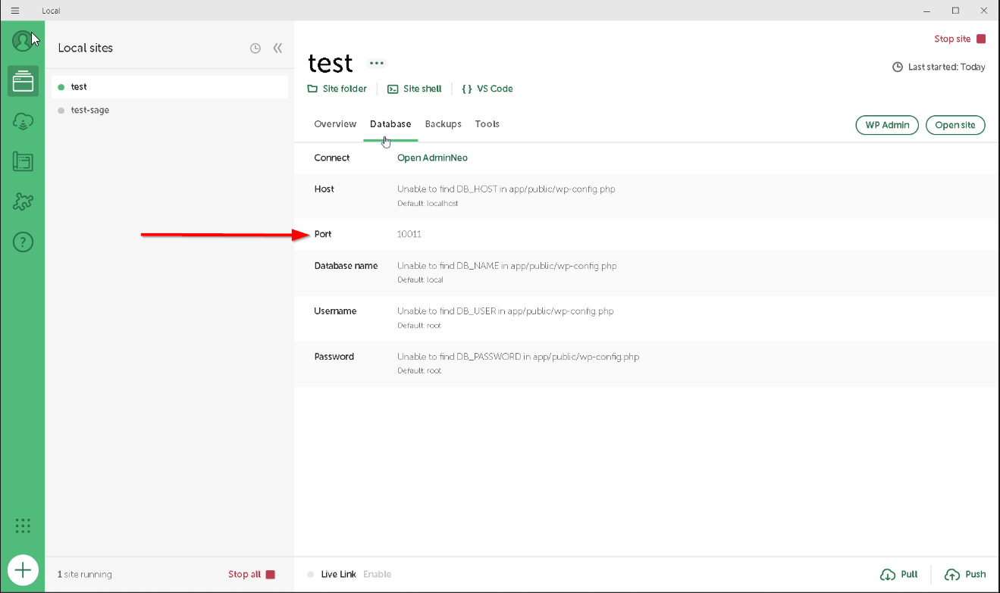

# WordPress Sage Starter

Starter de WordPress basado en Bedrock, Sage, Tailwind CSS, Gutenberg y ACF Free.

## Requisitos

- PHP >= 8.3
- Composer >= 2.x
- Node.js >= 20.19.0
- WP-CLI disponible en el `PATH`
- Git

## Instalación

1. Crea un repositorio desde la plantilla.

   Desde GitHub, abre el repositorio plantilla y pulsa **Use this template**.

   

2. Una vez clonado, ejecuta el script de requisitos para la instalación.

   ```powershell
   .\scripts\doctor.ps1
   ```

   Cualquier `ERROR` requiere solucionarlo antes de continuar con la instalación.

3. Crea o abre un sitio en LocalWP con WordPress instalado.

4. Apunta LocalWP a este repositorio.

   ```powershell
   .\scripts\link-localwp.ps1 -LocalSitePath "$env:USERPROFILE\Local Sites\<nombre-de-tu-sitio-local>"
   ```

5. Instala y configura el proyecto.

   Usa el dominio del sitio:

   

   Usa el puerto de la base de datos:

   

   ```powershell
   .\scripts\new-project.ps1 -ProjectName "<nombre-de-tu-proyecto>" -Domain "<tu-dominio-local>" -DbHost "127.0.0.1:<puerto-mysql-de-tu-sitio>"
   ```

6. Valida la instalación.

   ```powershell
   .\scripts\validate.ps1
   ```

## Arquitectura

Consulta el diagrama técnico:

https://carlos-cmp.github.io/wp-sage-starter/runtime-architecture/runtime-architecture.html
